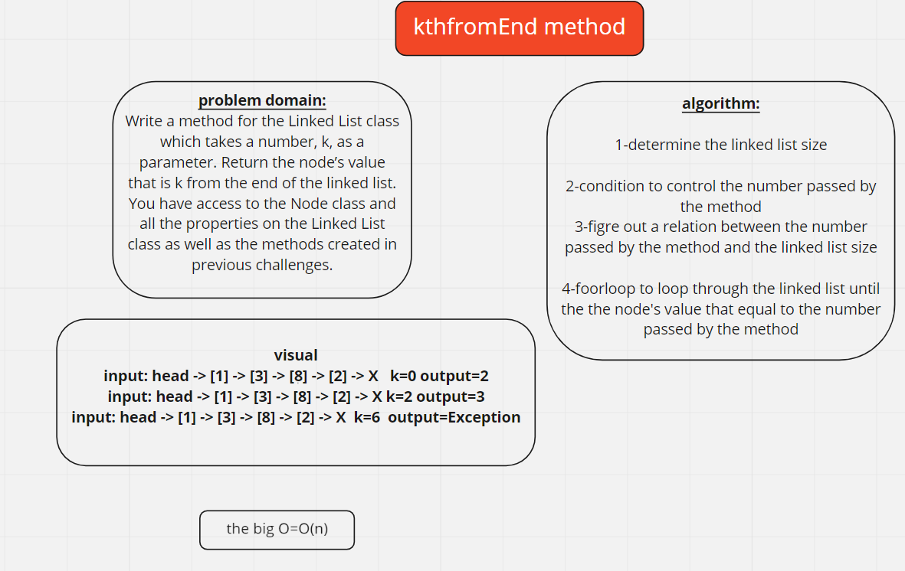

## Singly Linked List

_To create a linked-list with four methods which are .insert(value), includes(value),toString(value),.append(value),.insertBefore(value, newVal), .insertAfter(value, newVal)._

## Challenge Description

**Write the following methods for the Linked List class:**

_Define a method called insert which takes any value as an argument and adds a new node with that value to the head of the list with an O(1) Time performance._

_Define a method called includes which takes any value as an argument and returns a Boolean result depending on whether that value exists as a Node’s value somewhere within the list._

_Define a method called toString which takes in no arguments and returns a string representing all the values in the Linked List._

## Approach & Efficiency

for .insert(value) O(1) for .includes(value),.toString(value), O(n)

## API

_Define a method called insert which takes any value as an argument and adds a new node with that value to the head of the list with an O(1) Time performance._

_Define a method called includes which takes any value as an argument and returns a Boolean result depending on whether that value exists as a Node’s value somewhere within the list._

_Define a method called toString which takes in no arguments and returns a string representing all the values in the Linked List._

## challenge 7

### Challenge Description

_Write a method for the Linked List class which takes a number, k, as a parameter. Return the node’s value that is k from the end of the linked list. You have access to the Node class and all the properties on the Linked List class as well as the methods created in previous challenges._

## API

_Define a method called kthFromEnd which takes a value as an argument and Return the node’s value that is k from the end of the linked list._

### whiteboard

