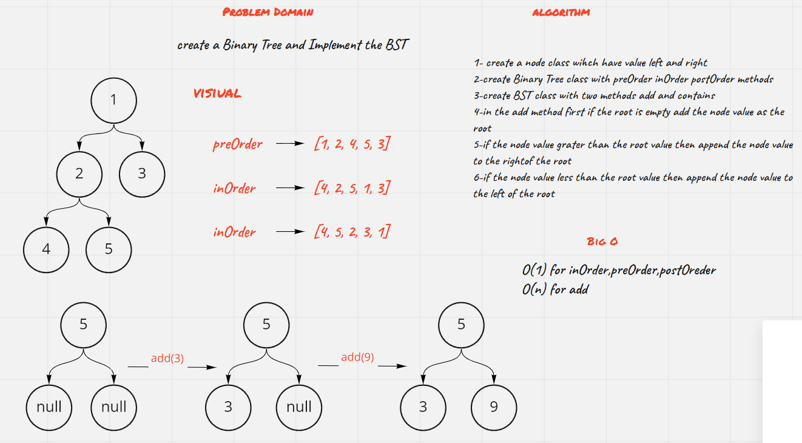
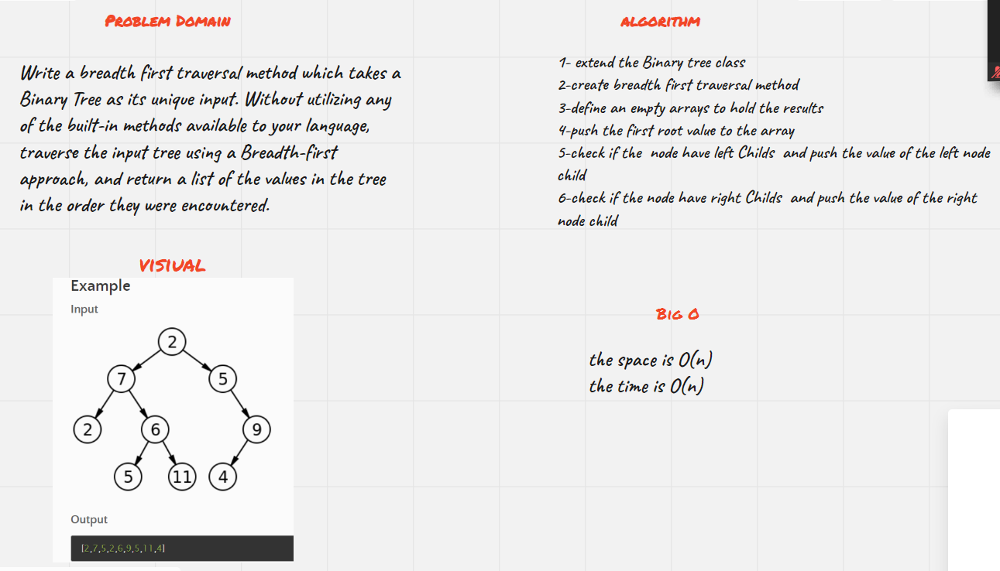

## Binary Tree and BST Implementation

### Challenge-15

_Create a Node class that has properties for the value stored in the node, the left child node, and the right child node._

_Create a BinaryTree class Define a method for each of the depth first traversals called preOrder, inOrder, and postOrder which returns an array of the values, ordered appropriately_

**preOrder** _which use ROOT - LEFT - RIGHT order to create a tree._

**inOrder** _which use LEFT - ROOT - RIGHT order to create a tree._

**postOrder** _which use LEFT - RIGHT - ROOT order to create a tree._

_Create a BinarySearchTree class_
_Define a method named add that accepts a value, and adds a new node with that value in the correct location in the binary search tree._
_Define a method named contains that accepts a value, and returns a boolean indicating whether or not the value is in the tree at least once._

**add()** _method will check if the add value is less or more than the root value and will add depend on that_

**contains()** _method will check if the value is esist or not in the tree_

**findMaximumValue()** _method will return the max value of the tree_

### Approach & Efficiency

_Time O(n) Space O(1) The approach was to create node create Binary tree class with inOrder, preOrder, postOrder methods to create a tree_

_Time O(n) space O(1)The approach was to create BST class with add and contains methods to add values into the tree and chrck if values exist in the tree_

### WhiteBoard

### Challenge-17

_Write a breadth first traversal method which takes a Binary Tree as its unique input. Without utilizing any of the built-in methods available to your language, traverse the input tree using a Breadth-first approach, and return a list of the values in the tree in the order they were encountered._

**breadth first traversal method** _which reads the tree by levels._

### Approach & Efficiency

_Time O(n) Space O(n) The approach was to create node create Binary tree class with breadth first traversal method_

### WhiteBoard

